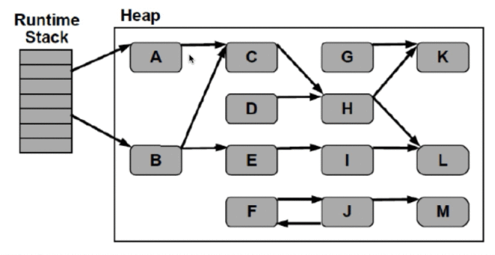
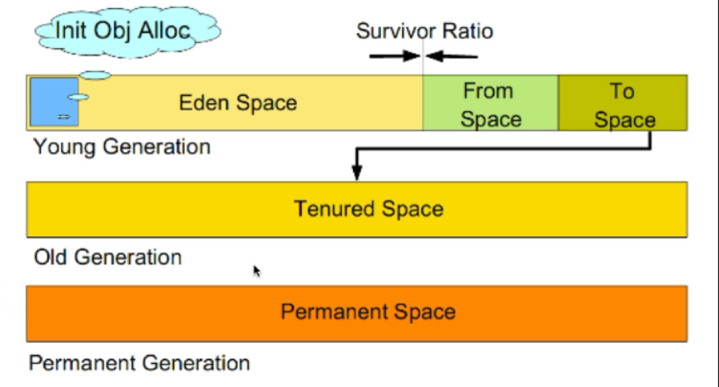

# Java内存结构

### java JVM内部结构


### java对象创建过程

```java
/**
 * Created BY poplar ON 2019/11/25
 * 关于Java对象创建的过程:
 * new关键字创建对象的3个步骤:
 * 1.在堆内存中创建出对象的实例。
 * 2.为对象的实例成员变量赋初值。
 * 3.将对象的引用返回
 * 指针碰撞(前提是堆中的空间通过一个指针进行分割，一侧是已经被占用的空间，另一侧是未被占用的空间)
 * 空闲列表(前提是堆内存空间中已被使用与未被使用的空间是交织在一起的，这时，虚拟机就需要通过一个列表来记录哪些空间是可以使用的，
 * 哪些空间是已被使用的，接下来找出可以容纳下新创建对象的且未被使用的空间，在此空间存放该对象，同时还要修改列表上的记录)
 * 对象在内存中的布局:
 * 1.对象头.
 * 2.实例数据(即我们在一个类中所声明的各项信息)
 * 3.对齐填充(可选) !
 * 引用访问对象的方式:
 * 1.使用句柄的方式。
 * 2.使用直接指针的方式。
 */
public class MemoryTest1 {
    public static void main(String[] args) {
        //-Xms5m -Xmx5m -XX:+HeapDumpOnOutOfMemoryError 设置jvm对空间最小和最大以及遇到错误时把堆存储文件打印出来
        //打开jvisualvm装在磁盘上的转存文件
        List<MemoryTest1> list = new ArrayList<>();
        while (true) {
            list.add(new MemoryTest1());
            System.gc();
        }
    }
}
```

### 虚拟机栈溢出测试

```java
/**
 * Created BY poplar ON 2019/11/25
 * 虚拟机栈溢出测试
 */
public class MemoryTest2 {

    private int length;

    public int getLength() {
        return length;
    }

    public void test() throws InterruptedException {
        length++;
        Thread.sleep(1);
        test();
    }

    public static void main(String[] args) {
        //测试调整虚拟机栈内存大小为：  -Xss160k，此处除了可以使用JVisuale监控程序运行状况外还可以使用jconsole
        MemoryTest2 memoryTest2 = new MemoryTest2();
        try {
            memoryTest2.test();
        } catch (Throwable e) {
            System.out.println(memoryTest2.getLength());//打印最终的最大栈深度为：2587
            e.printStackTrace();
        }
    }
}
```

###  元空间溢出测试

```java
/**
 * Created BY poplar ON 2019/11/26
 * 元空间内存溢出测试
 * 设置元空间大小：-XX:MaxMetaspaceSize=100m
 * 关于元空间参考：https://www.infoq.cn/article/java-permgen-Removed
 */
public class MemoryTest3 {
    public static void main(String[] args) {
        //使用动态代理动态生成类
        while (true) {
            Enhancer enhancer = new Enhancer();
            enhancer.setSuperclass(MemoryTest3.class);
            enhancer.setUseCache(false);
            enhancer.setCallback((MethodInterceptor) (obj, method, ags, proxy) -> proxy.invokeSuper(obj, ags));
            System.out.println("Hello World");
            enhancer.create();// java.lang.OutOfMemoryError: Metaspace
        }
    }
```

### JVM命令使用

```java
/**
 * Created BY poplar ON 2019/11/26
 * jmam命令的使用 -clstats<pid>进程id  to print class loader statistics
 * jmap -clstats 3740
 *
 * jstat -gc 3740
 *  S0C    S1C    S0U    S1U      EC       EU        OC         OU       MC     MU    CCSC   CCSU   YGC     YGCT    FGC    FGCT     GCT
 * 512.0  512.0   0.0    0.0   24064.0   9626.0   86016.0     1004.1   4864.0 3758.2 512.0  409.1     144    0.064   0      0.000    0.064
 * MC元空间总大小，MU元空间已使用的大小
 */
public class MemoryTest4 {
    public static void main(String[] args) {
        while (true)
            System.out.println("hello world");
    }
    //查看java进程id jps -l
    // 使用jcmd查看当前进程的可用参数：jcmd 10368 help
    //查看jvm的启动参数 jcmd 10368 VM.flags
   // 10368:-XX:CICompilerCount=3 -XX:InitialHeapSize=132120576 -XX:MaxHeapSize=2111832064 -XX:MaxNewSize=703594496
    // -XX:MinHeapDeltaBytes=524288 -XX:NewSize=44040192 -XX:OldSize=88080384 -XX:+UseCompressedClassPointers
    // -XX:+UseCompressedOops -XX:+UseFastUnorderedTimeStamps -XX:-UseLargePagesIndividualAllocation -XX:+UseParallelGC

}
```


### JVM常用命令

```java
jcmd (从JDK 1. 7开始增加的命令)
1. jcmd pid VM.flags: 查看JVM的启动参数
2. jcmd pid help: 列出当前运行的Java进程可以执行的操作
3. jcmd pid helpJFR.dump:查看具体命令的选项
4. jcmd pid PerfCounter.print:看JVm性能相关的参数
5. jcmd pid VM.uptime:查有JVM的启动时长
6. jcmd pid GC.class_ histogram: 查看系统中类的统计信息
7. jcmd pid Thread.print: 查看线程堆栈信息
8. jcmd pid GC.heap dump filename 导出Heap dump文件， 导出的文件可以通过jvisualvm查看
9. jcmd pid VM.system_ properties:查看JVM的属性信息

```

### JVM内存举例说明

```java
   public void method() {
        Object object = new Object();

        /*生成了2部分的内存区域，1)object这个引用变量，因为
        是方法内的变量，放到JVM Stack里面,2)真正Object
        class的实例对象，放到Heap里面
        上述 的new语句一共消耗12个bytes, JVM规定引用占4
        个bytes (在JVM Stack)， 而空对象是8个bytes(在Heap)
        方法结束后，对应Stack中的变量马上回收，但是Heap
        中的对象要等到GC来回收、*/
    }
```


### JVM垃圾识别（根搜索算法( GC RootsTracing )）

- 在实际的生产语言中(Java、 C#等)，都是使用根搜索算法判定对象是否存活。

- 算法基本思路就是通过一系列的称为“GCRoots"的点作为起始进行向下搜索，当一个对象到GCRoots没有任何引用链( Reference Chain)相连，则证明此对象
  是不可用的

- 在Java语言中，GC Roots包括
  ●在VM栈(帧中的本地变量)中的引用
  ●方法区中的静态引用
  ●JNI (即一般说的Native方法) 中的引用

### 方法区

- Java虛拟机规范表示可以不要求虚拟机在这区实现GC,这区GC的“性价比”一般比较低
  在堆中，尤其是在新生代，常规应用进行I次GC一般可以回收70%~95%的空间，而方法区的GC效率远小于此
- 当前的商业JVM都有实现方法区的GC,主要回收两部分内容:废弃常量与无用类

- 主要回收两部分内容:废弃常量与无用类
- 类回收需要满足如下3个条件：
  - 该类所有的实例都已经被GC,也就是JVM中不存在该Class的任何实例
  - 加载该类的ClassL oader已经被GC
  - 该类对应的java.lang.Class对象没有在任何地方被引用，如不能在任何地方通过反射访问该类的方法

- 在大量使用反射、动态代理、CGLib等字节码框架、动态生成JSP以及OSGi这类频繁自定义Classloader的场景都需要JVM具备类卸载的支持以保证方法区不会溢出

### 垃圾判断与GC算法

- 垃圾判断的算法
  - 引用计数算法(Reference Counting)
  - 根搜索算法( GC RootsTracing )
  - 在实际的生产语言中(Java、 C#等)都是使用根搜索算法判定对象是否存活
  - 算法基本思路就是通过一一系列的称为GCRoots"的点作为起始进行向下搜索，当一个对象到GC Roots没有任何引用链(Reference Chain)相连，则证明此对象是不可用的

- 在Java语言中，可作为GC Roots的对象包括下面几种： 
  - 虚拟机栈（栈帧中的本地变量表）中引用的对象。 
  - 方法区中类静态属性引用的对象。 
  - 方法区中常量引用的对象。 
  - 本地方法栈中JNI（即一般说的Native方法）引用的对象


- 标记-清除算法(Mark Sweep)
- 标记-整理算法(Mark-Compact)
- 复制算法(Copying)
- 分代算法(Generational)

### 标记一清除算法(Mark-Sweep)

- 算法分为“标记”和“清除”两个阶段，
  首先标记出所有需要回收的对象，然后回
  收所有需要回收的对象

- 缺点
  效率问题，标记和清理两个过程效率都不高
  空间问题，
  标记清理之后会产生大量不连续的内存碎片，空间碎片太多可能会导致后续使用中无法找到足够的连续内存而提前触发另一次的垃圾搜集动作

- 效率不高，需要扫描所有对象。堆越大，GC越慢
  存在内存碎片问题。GC次数越多，碎片越为严重

  

  

### 复制(Copying) 搜集算法

- 将可用内存划分为两块，每次只使用其中的一块，当一半区内存用完了，仅将还存活
  的对象复制到另外一块上面，然后就把原来整块内存空间一次性清理掉，
- 这样使得每次内存回收都是对整个半区的回收，内存分配时也就不用考虑内存碎片等复杂情况，只要移动堆顶指针，按顺序分配内存就可以了，实现简单，运行高效。<font color=red>只是这种算法的代价是将内存缩小为原来的一半，代价高昂</font>

- 现在的商业虚拟机中都是用了这一种收集算法来回收新生代
- 将内存分为一块较大的eden空间和2块较少的survivor空间，每次使用eden和其中一块
  survivor, 当回收时将eden和survivor还存活的对象一次性拷 贝到另外一块survivor空间上，然后清理掉eden和用过的survivor
- Oracle Hotspot虚拟机默认eden和survivor的大小比例是8:1，也就是每次只有10%的内存是“浪费”的

- 复制收集算法在对象存活率高的时候，效率有所下降
- 如果不想浪费50%的空间，就需要有额外的空间进行分配担保用于应付半区内存中所有对象都100%存活的极端情况，所以在老年代一般不能直接选用这种算法


- 只需要扫描存活的对象，效率更高
- 不会产生碎片
- 需要浪费额外的内存作为复制区
- 复制算法非常适合生命周期比较短的对象，因为每次GC总能回收大部分的对象，复制的开销比较小
- 根据IBM的专i研究，98%的Java对象只会存活1个GC周期，对这些对象很适合用复制算法。而且
  不用1: 1的划分工作区和复制区的空间

### 标记一整理( Mark-Compact )算法

- 标记过程仍然样，但后续步骤不是进行直接清理，而是令所有存活的对象一端移动，然后直接清理掉这端边界以外的内存。

- 没有内存碎片
- 比Mark-Sweep耗费更多的时间进行compact

### 分代收集。( GenerationalCollecting)算法

- 当前商业虚拟机的垃圾收集都是采用“分代收集”( Generational Collecting)算法，根据对象不同的存活周期将内存划分为几块。
- 一般是把Java堆分作新生代和老年代，这样就可以根据各个年代的特点采用最适当的收集算法，譬如新生代每次GC都有大批对象死去，只有少量存活，那就选用复制算法，只需要付出少量存活对象的复制成本，就可以完成收集。

### Hotspot JVM 6中共划分为三个代:

- 年轻代(Young Generation)
- 老年代(Old Generation)和
- 永久代( Permanent Generation)



- 年轻代(Young Generation)
  新生成的对象都放在新生代。年轻代用复制算法进行GC (理论上年轻代对象的生命周期非常短，所以适合复制算法)
- 年轻代分三个区。一个Eden区，两个Survivor区(可以通过参数设置Survivor个数)。对象在Eden区中生成。当Eden区满时，还存活的对象将被复制到一个Survivor区，当这个Survivor区满时，此区的存活对象将被复制到另外一个Survivor区，当第二个Survivor区也满了的时候，从第一个Survivor区复制过来的并且此时还存活的对象，将被复制到老年代。2个Survivor是完全对称，轮流替换。
- Eden和2个Survivor的缺省比例是8:1:1，也就是10%的空间会被
  浪费。可以根据GClog的信息调整大小的比例

- 老年代(Old Generation)
  - 存放了经过一次或多次GC还存活的对象
  - 一般采用Mark-Sweep或者Mark-Compact算法进行GC 
  - 有多种垃圾收集器可以选择。每种垃圾收集器可以看作一个GC算法的具体实现。可以根据具体应用的需求选用合适的垃圾收集器(追求吞吐量?追求最短的响应时间?)

- ~~永久代~~
  - 并不属于堆(Heap).但是GC也会涉及到这个区域
  - 存放了每个Class的结构信息， 包括常量池、字段描述、方法描述。与垃圾收集要收集的Java对象关系不大

### 内存分配与回收

- 堆上分配
  大多数情况在eden上分配，偶尔会直接在old上分配细节取决于GC的实现
- 栈上分配
  原子类型的局部变量

- GC要做的是将那些dead的对象所占用的内存回收掉
  - Hotspot认为没有引用的对象是dead的
  - Hotspot将引用分为四种: Strong、 Soft、Weak、Phantom
    Strong即默认通过Object o=new Object()这种方式赋值的引用
    Soft、Weak、 Phantom这 三种则都是继承Reference

- 在Full GC时会对Reference类型的引用进行特殊处理
  - Soft:内存不够时一定会被GC、长期不用也会被GC
  - Weak: - 定会被GC， 当被mark为dead, 会在ReferenceQueue中通知
  -  Phantom: 本来就没引用，当从jvm heap中释放时会通知

垃圾回收器


### GC回收的时机

- 在分代模型的基础上，GC从时机上分为两种: Scavenge GC和Full GC 
  - Scavenge GC (Minor GC)
    触发时机:新对象生成时，Eden空间满了理论上Eden区大多数对象会在ScavengeGC回收，复制算法的执
    行效率会很高，ScavengeGC时间比较短。
  - Full GC
    对整个JVM进行整理，包括Young、Old 和Perm主要的触发时机: 1) Old满了2) Perm满了3) system.gc()效率很低，尽量减少Full GC。

### 垃圾回收器(Garbage Collector)

- 分代模型: GC的宏观愿景;
- 垃圾回收器: GC的具体实现
- Hotspot JVM提供多种垃圾回收器，我们需要根据具体应用的需要采用不同的回收器
- 没有万能的垃圾回收器，每种垃圾回收器都有自己的适用场景

### 垃圾收集器的‘并行”和并发

- 并行(Parallel):指多个收集器的线程同时工作，但是用户线程处于等待状态
- 并发(Concurrent):指收集器在工作的同时，可以允许用户线程工作。并发不代表解决了GC停顿的问题，在关键的步骤还是要停顿。比如在收集器标记垃圾的时候。但在清除垃圾的时候，用户线程可以和GC线程并发执行。

### Serial收集器

- 最早的收集器，单线程进行GC， New和Old Generation都可以使用，在新生代，采用复制算法;
- 在老年代，采用Mark-Compact算法因为是单线程GC，没有多线程切换的额外开销，简单实用
  Hotspot Client模式默认的收集器


### ParNew收集器

- ParNew收集器就是Serial的多线程版本，除了使用多个收集线程外，其余行为包括算法、STW、对象分配规则、回收策略等都与Seria收集器一模一样。
- 对应的这种收集器是虚拟机运行在Server模式的默认新生代收集器，在单CPU的环境中，ParNew收集器并不会比Serial收集器有更好的效果

- Serial收集器在新生代的多线程版本
- 使用复制算法(因为针对新生代)只有在多CPU的环境下，效率才会比Serial收集器高
- 可以通过-XX:ParallelGC Threads来控制GC线程数的多少。需要结合具体CPU的个数Server模式下新生代的缺省收集器


### Parallel Scavenge收集器

- Parallel Scavenge收集器也是一个多线程收集器，也是使用复制算法，但它的对象分配规则与回收策略都与ParNew收集器有所不同，它是以吞吐量最大化(即GC时间占总运行时间最小)为目标的收集器实现，它允许较长时间的STW换取总吞吐量最大化

### CMS ( Concurrent Mark Sweep )收集器

- CMS是一种以最短停顿时间为目标的收集器，使用CMS并不能达到GC效率最高(总体GC时间最小)，但它能尽可能降低GC时服务的停顿时间，CMS收集器使用的是标记一清除算法
- 特点：
  - 追求最短停顿时间，非常适合Web应用
  - 只针对老年区，一般结合ParNew使用
  - Concurrent, GC线程和用户线程并发工作(尽量并发 )
  - Mark-Sweep
  - 只有在多CPU环境下才有意义
  - 使用-XX:+UseConcMarkSweepGC打开

- CMS收集器的缺点
  - CMS以牺牲CPU资源的代价来减少用户线程的停顿。当CPU个数少于4的时候，有可能对吞吐量影响非常大
  - CMS在并发清理的过程中，用户线程还在跑。这时候需要预留一部分空间给用户线程
  - CMS用Mark-Sweep,会带来碎片问题。碎片过多的时候会容易频繁触发FullGC


